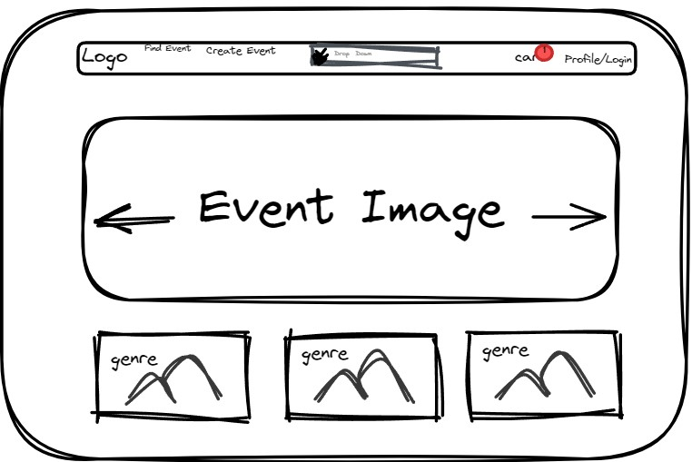
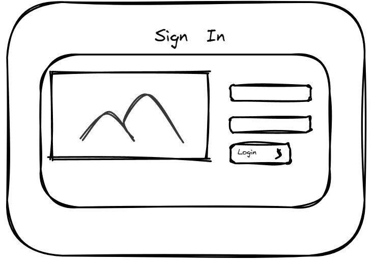
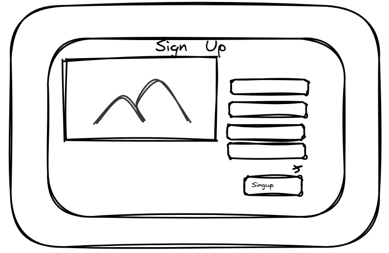
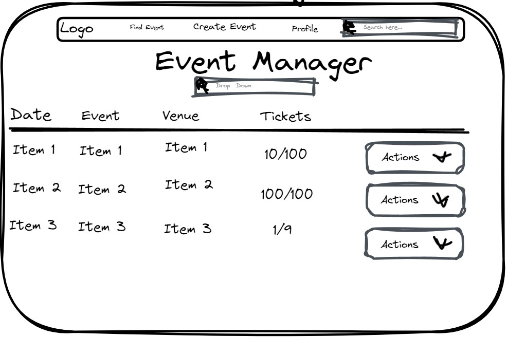
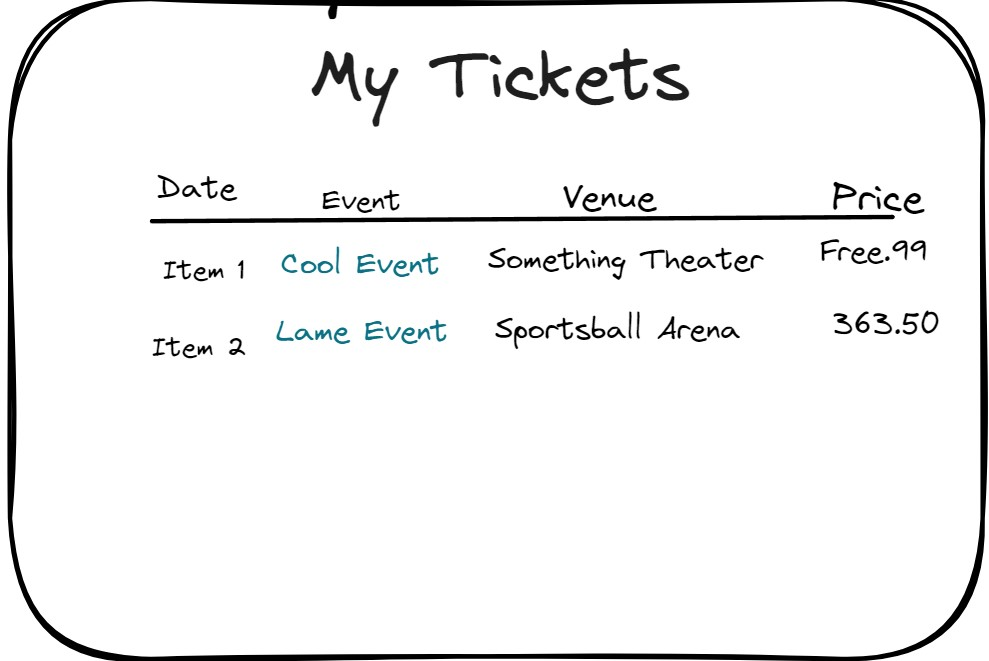
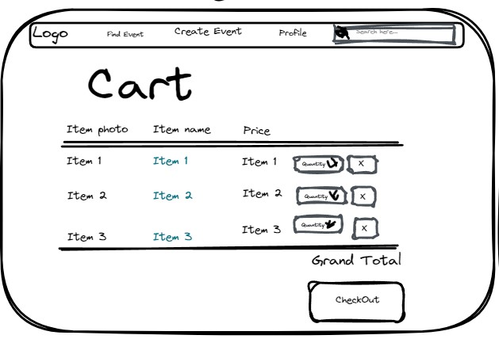
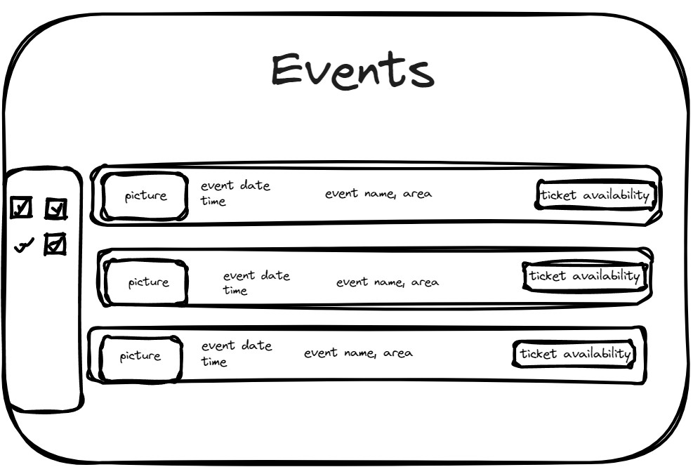
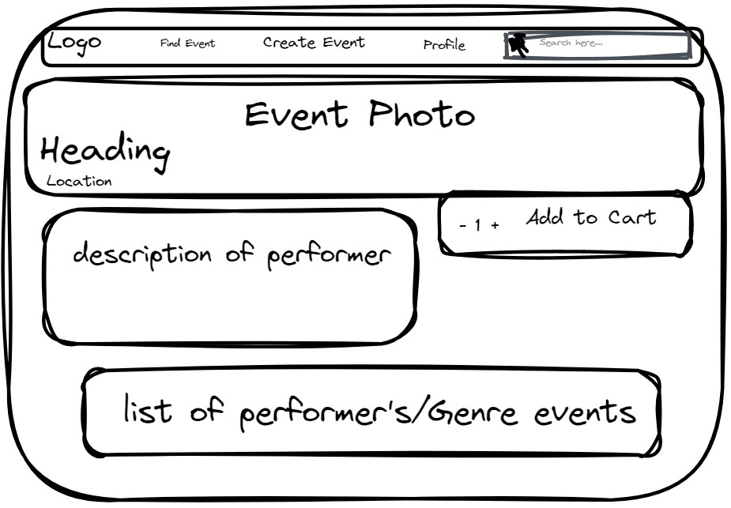
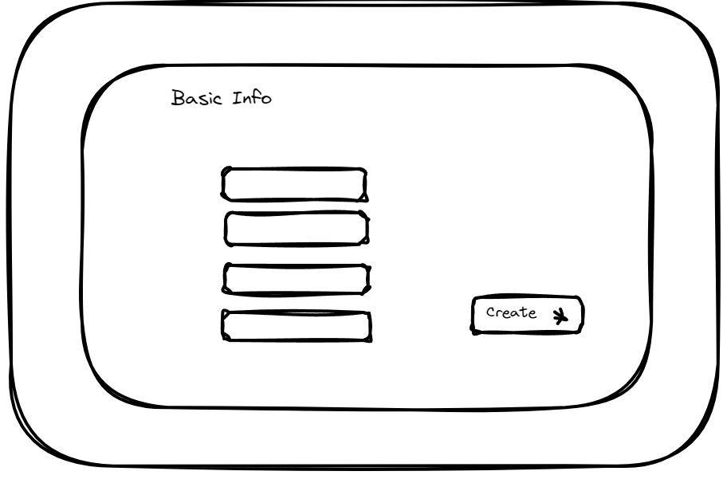

# Graphical Human Interface

## Home Page

This is the page where visitors will land. There will be a display carousel that will link you to detail page of that specific event. There will be three icons at the bottom of the page that will link you to find an event with that filter already specified

## Login Page

This is where a user can log in.

## Sign-up Page

This is where a user can sign up.

## Profile Page

This the base profile page. A user can view their purchased tickets. A user can become an event-manager and view/edit their created events. A user can change their profile information.

## Events Manager

This is a page within the profile page that displays any events that a user has created. It also allows actions to edit or delete an event.

## My Tickets

This is a page within the profile page that displays any tickets a user purchased.

## Cart

This page is where a user can adjust the ammount of tickets they wish to buy or remove an event from their cart. They can then purchase the tickets

## Events List

This page displays any available events that a user may purchase tickets.

## Event Details

This is an event details page. It will display all of the event data and allow you to add tickets to the cart.

## Create Event

This is a form to create a new event.

